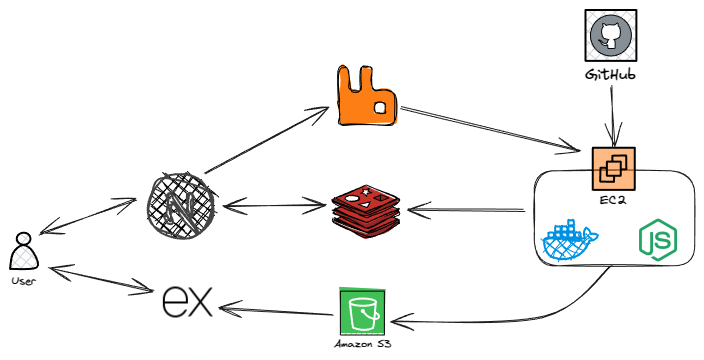

# Project Setup Guide

This document outlines the steps required to set up and run the project locally.

## Project Architecture

The following diagram illustrates the project's architecture:



This image displays the high-level architecture of the project.

## Prerequisites

* **Git:** Ensure Git is installed on your system.
* **Node.js and npm:** Node.js and npm are required for dependency management and running scripts.
* **Docker:** Docker must be installed and configured. It is highly recommended to configure Docker to run without `sudo` privileges. If you haven't done so, please follow this tutorial: [How to Run Docker Commands Without Sudo](https://medium.com/devops-technical-notes-and-manuals/how-to-run-docker-commands-without-sudo-28019814198f).

## Setup Instructions

1.  **Clone the Repository:**

    ```bash
    git clone https://github.com/sidharthtripathi/netlify
    ```

2.  **Navigate to the Cloned Directory:**

    ```bash
    cd netlify
    ```

3.  **Install Dependencies:**

    ```bash
    npm install
    ```

    This command installs all necessary dependencies defined in the `package.json` file.

4.  **Build Docker Container:**

    ```bash
    npm run build:container
    ```

    This script builds the necessary Docker containers for the project. Ensure Docker is running and accessible.

5.  **Configure Environment Variables:**

    The project utilizes environment variables for configuration. Each workspace within the `apps` directory (`webserver`, `s3-proxy`, and `builder`) requires specific environment variables.

    * Navigate to each workspace's directory (`apps/webserver`, `apps/s3-proxy`, `apps/builder`).
    * Copy the `.env.example` file to `.env` in each respective workspace.
    * Modify the `.env` files with the appropriate values for your environment.

6.  **Start the Development Environment:**

    From the root directory of the project, execute the following command:

    ```bash
    npm run dev
    ```

    This command starts the development server, which will launch the application in development mode.